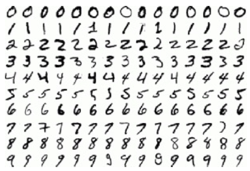
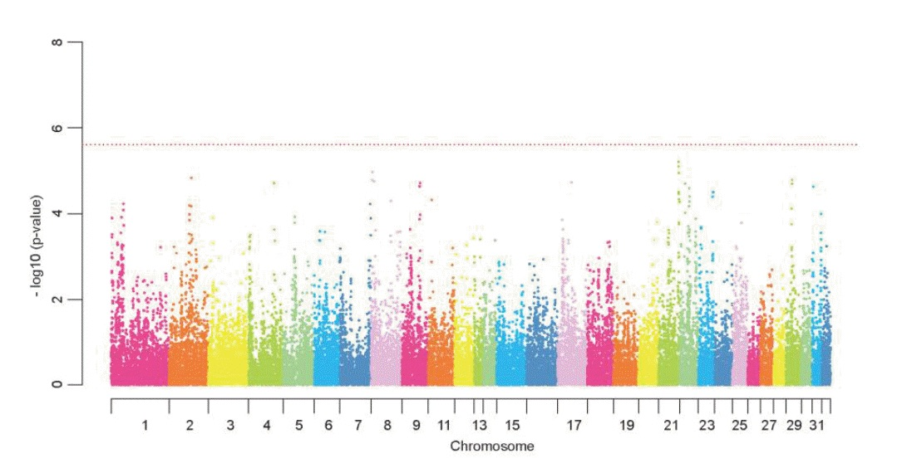
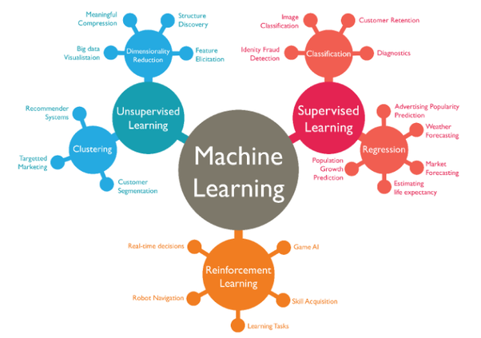
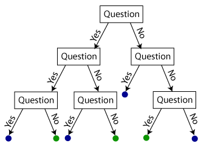
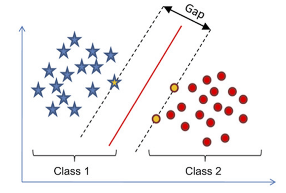
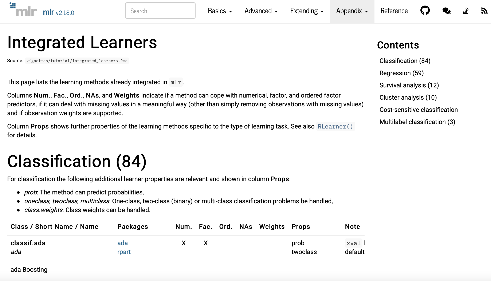
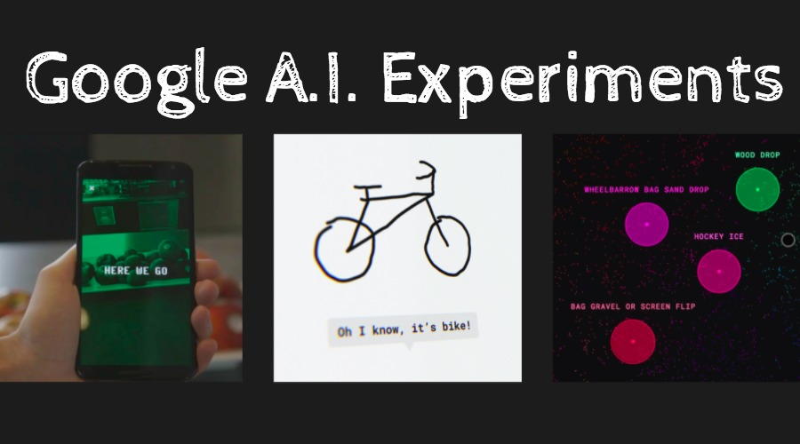

```{r setup, include=FALSE}
knitr::opts_chunk$set(dev = 'pdf',  messages = FALSE, fig.align = 'center')
par(mar=c(3,3,2,1), mgp=c(2,.7,0), tck=-.01,las=1)
library(dplyr)
library(readr)
library(mlr)
library(h2o)
h2o.init(nthreads = -1) # Set up h20 to run in parallel
# Source in some code to load the data from GitHub
source('https://gist.githubusercontent.com/brendano/39760/raw/22467aa8a5d104add5e861ce91ff5652c6b271b6/gistfile1.txt')
train = NULL
load_mnist()
mnist = cbind(rbind(train$x, test$x), 
              c(train$y, test$y)) %>% as.data.frame
colnames(mnist) = c(paste0('pix',1:784), 'digit')
```

## Outline of today

- Machine learning jargon
- How to do machine learning
- Description of machine learning black boxes
- Image classification example
- Assessing performance
- Introduction to Rstudio
- Longer code examples

## What is ML and AI?

  - ML and AI are methods to make a computer take input data and make predictions.
  - In the recent past, a huge explosion has led to the Big Data revolution:
  
    - Volume
    - Variety
    - Veracity
    - Velocity

## Example 1: digit recognition

```{r, echo = FALSE, out.height = "80%"}

```

## Example 2: genomics

```{r,  echo = FALSE, out.height = "80%"}

```

## Example 3: manufacturing

```{r, echo = FALSE, out.height = "80%"}

```


## The goal

$$\mbox{Features} \rightarrow \mbox{Black box} \rightarrow \mbox{Target}$$

  - Target: the value to be predicted
  - Features: the values used to predict from
  - Training data: The rectangular set of features and target values upon which to fit the …
  - Black box (Machine learning model): the algorithm by which predictions are made
  - Test data: Another rectangular data set with known target and feature values on which to evaluate performance

The number of features is usually called $p$ and the number of samples $n$

## Traditional statistics vs ML

  - Traditional statistical analysis has focused on linear regression models and their extensions
  - Often this ignores interactions and struggles in very large data sets
  - People often base their results on $p$-values
  
  - ML creates non-linear models with automatic interaction detection and works well on big data
  - However you lose interpretation and the focus is often solely on prediction (rather than causation)
  - ML models often ignore the experimental design
  - ML models often do not provide uncertainty in predictions

## Example code

```{r, eval = FALSE}
library(mlr)
# Make a task
task_1 = makeRegrTask(data = my_data_set,
                      target = 'y') 
# Create training and test sets
test_set = sample(n, size = n/4)
train_set = (1:n)[-test_set]
# Set up a leaner
learner_1 = makeLearner('regr.randomForest')
# Train it on the training data
train_1 = train(learner = learner_1, task = task_1,
                subset = train_set) 
# Predict on the test set data
pred_1 = predict(object = train_1, task = task_1, subset = test_set)
# Check performance
performance(pred_1)
```

## Reminder of terminology

  - A task is the data set, the features, and the target variable
  - A training and test set are just the rows of the data that we will train and test our model on
  - A learner is a black box that aims to predict the target from the features
  - The predictions on the test set can be compared to the true target values to judge the performance of the learner

## Types of Machine learning

```{r, echo = FALSE, out.height = "80%"}

```

## Measuring performance

  - If the data set is big enough (i.e. $n$ large), split into a training and test set
  - Fit the machine learning model on the training set
  - Evaluate performance on the test set
  - The training and the test set must be as separate as possible

A proper validation will use a separately collected test set

## Common pitfalls

  - You get to choose the targets and the features; you need to choose these well
  - You must get the validation right
  - If the data contain serious biases they will be reflected in the model
  - If you have a small data set (e.g. $n<10,000$), sophisticated ML will not help much compared to simple models
  
## Big data: fat vs tall

  - Lots of manufacturing data is fat data, i.e. there are more features than cases ($p \gg n$)
  - This causes problems for some traditional statistical models but ML can still work well here
  - However, identification of effects gets harder as does validation
  - Most of the successes of ML have come from tall data where there are many more cases than features ($n \gg p$)
  
## What are the black boxes?

If we write the target as $y$ and the features as $X$ all these can be written as rectangular data structures (like an Excel spreadsheet)

Our job is to find $f$ in:
$$y = f(X) + e$$
by making the $e$ error values as small as possible

  - $f$ is known as a learner. There are lots of different types: linear regression, neural networks, random forests, support vector machines, . . .

## 1. Linear regression

The simplest possible useful model is a linear regression model: 
$$y = a + b_1x_1 +b_2x_2 +b_3x_3 + \ldots +e $$
so $f(X) = a + b_1x_1 +b_2x_2 +b_3x_3 + \ldots$

  - We usually minimise the least squares function:
$$\sum (y - f(X))^2$$
This gives us the best values of $b_1, b_2$, etc

## 2. Random forests

Change the function $f$ to be a set of \emph{decision trees}
```{r, echo = FALSE, out.height = "80%"}

```

## 3. Support vector machines

Use only those data points that affect the final prediction:
```{r, echo = FALSE, out.height = "80%"}

```

## 4. Neural networks

Make the regression weight ($b$) depend on other regression weights
```{r,  echo = FALSE, out.height = "80%"}
knitr::include_graphics('img/nn_pic.jpg')
```

## 5. Other black boxes

```{r, echo = FALSE, out.height = "80%"}

```

## Example: the digits data


```{r, out.height = "80%", echo = FALSE}
show_digit(train$x[5,])
```

## What does the full data look like?

```{r}
dim(mnist)
mnist[1:6, c(405:410, 785)] # Mostly white!
```

## Fitting a random forest classifier

```{r, results = 'hide', warning=FALSE}
# Make a task and set up training/test sets
task_mn = makeClassifTask(data = mnist, target = 'digit')
train_set = 1:60000
test_set = 60001:70000
# Set up a leaner
learner_rf = makeLearner('classif.h2o.randomForest',
                         predict.type = 'prob') 
# Train it on the training data
train_rf = train(learner = learner_rf, task = task_mn, subset = train_set)
pred_rf = predict(object = train_rf, task = task_mn, subset = test_set)
```
```{r}
# Check performance
print(performance(pred_rf))
```

## How well did it go?

```{r, echo = FALSE}
probs = pred_rf$data[,3:12]
class = apply(probs, 1, which.max) - 1
print(table(pred_rf$data$truth, class))

```


## What about other ML black boxes?

It is now easy to train other models in the same way

```{r, results = 'hide', warning=FALSE}
learner_dl = makeLearner('classif.h2o.deeplearning', 
                         predict.type = 'prob')
# Train it on the training data
train_dl = train(learner = learner_dl, 
                 task = task_mn, 
                 subset = train_set)
# Predict on the test set data
pred_dl = predict(object = train_dl, 
                  task = task_mn, 
                  subset = test_set)
```
```{r}
print(performance(pred_dl))
```

## Assessing performance of ML models

  - A good model should have predicted values close to the true values, or predicted classes close to the true classes. Some models will also produce uncertainties (e.g. intervals) or probabilities which can help determine the quality of the fit
  - The usual ones people use are the root mean squared error (for regression problems), the misclassification rate (for classification problems)
  - Other more advanced ones for classifiers include the receiver operator characteristic curve and precision-recall curve. These work on the probabilities of each observation being in a particular class
  
## Key challenges for ML in Additive Manufacturing

  - How do we merge multiple different types of data sets together
  - How do we deal with missing data?
  - How do we quantify uncertainty in very large data sets?
  - How do we deal with streaming data?
  - How do we incorporate human/sensor feedback?
  - How do we deal with multivariate targets?

## Lastly, why not have a play with ML yourself?

\texttt{https://aiexperiments.withgoogle.com/quick-draw}

```{r, echo = FALSE, , out.height = "60%"}

```

If you want to run the code for any of the analysis in the presentation visit https://goo.gl/kG4CM5

